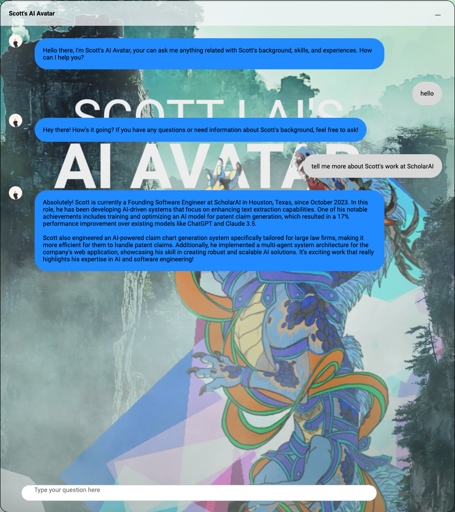

# ScottBot

ScottBot is an AI-powered chatbot that simulates conversations with Scott, providing information about Scott's background, skills, and experiences. It uses a combination of natural language processing and a knowledge base derived from Scott's information to answer user queries.




## Features

- Interactive chat interface
- AI-powered responses based on Scott's background
- Drag-and-drop chat window
- Responsive design
- File upload capability for training data

## Technology Stack

- Backend: FastAPI (Python)
- Frontend: HTML, CSS, JavaScript
- AI/ML: LangChain, OpenAI GPT models
- Vector Database: FAISS
- PDF Processing: PyPDF2

## Setup and Installation

1. Clone the repository:

   ```
   git clone https://github.com/yourusername/scottbot.git
   cd scottbot
   ```
2. Install dependencies:

   ```
   pip install -r requirements.txt
   ```
3. Set up environment variables:
   Create a `.env` file in the root directory and add your OpenAI API key:

   ```
   OPENAI_API_KEY=your_api_key_here
   ```
4. Run the application:

   ```
   python -m uvicorn app:app --host 0.0.0.0 --port 8000
   ```
5. Open a web browser and navigate to `http://localhost:8000` to use the chatbot.

## Docker Support

You can also run ScottBot using Docker:

1. Build the Docker image:

   ```
   docker build -t scottbot .
   ```
2. Run the Docker container:

   ```
   docker run -p 8000:8000 -e OPENAI_API_KEY=your_api_key_here scottbot
   ```

## Usage

- Click on the chat widget to open the chat interface.
- Type your questions about Scott in the input field and press Enter or click the send button.
- The AI will respond with relevant information based on Scott's background.

## Customization

To customize ScottBot for a different individual:

1. Replace the PDF file in the `upload_files` function with a document containing the desired person's information.
2. Update the profile picture and name in the `script.js` file.
3. Modify the introduction message in `script.js` to reflect the new individual.

## Contributing

Contributions are welcome! Please feel free to submit a Pull Request.

## License

This project is licensed under the MIT License - see the LICENSE file for details.
